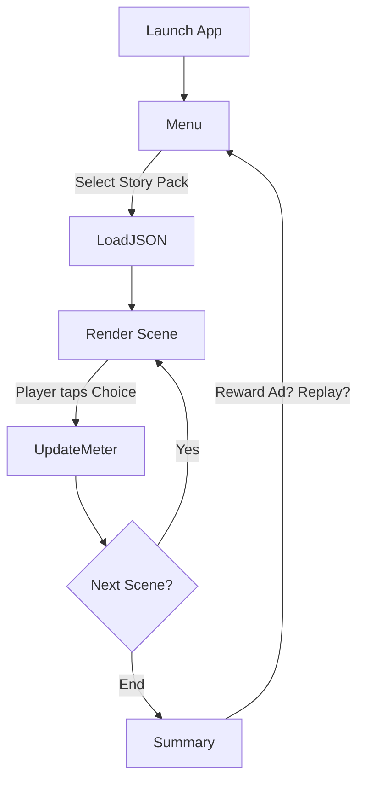

# Character Interactive Fiction Platform

**Target Platforms:** iOS & Android
**Tech Stack:** React Native (Expo) · Cursor IDE · Firebase · AdMob / Unity Ads

> *Step into the shoes of any iconic character—solve mysteries as Sherlock Holmes, roam Transylvania as Dracula, navigate Regency society as Elizabeth Bennet, or tumble down a rabbit‑hole as Alice. Your decisions branch the narrative while an AI‑driven "Persona Meter" tracks how faithfully you play the part.*

---
## Core of the game is using LLM for dynamic narrative. 
At the core of InCharacter is a powerful AI-driven universe model. For each character pack (e.g., Dracula, Pride & Prejudice, Sherlock Holmes), the full source material (the entire book or script) is loaded into the AI's knowledge base.
How it works:
🎭 Character Persona Rules and worldview are distilled from the text.
📖 Early Scenes Are Canonical: The first few scenes are directly derived from the original story to anchor tone and structure.
🧠 Deviation Triggers Divergence: Once the player makes a decision outside the canonical path, the AI begins to generate alternate timelines.
🌐 Universe Consistency: All generated scenes are still “internally consistent” with the world, tone, and character logic modeled from the book.
♻️ Replay = New Universes: No two playthroughs are alike—even replaying as the same character can yield new plots, twists, or outcomes.

## 1 · Key Gameplay Features

| # | Feature                         | What It Does                                                                                                                                                               |
| - | ------------------------------- | -------------------------------------------------------------------------------------------------------------------------------------------------------------------------- |
| 1 | **Multi‑Character Story Packs** | Modular JSON packs let us ship Holmes, Dracula, Austen, etc.—public‑domain first, licenced IP later.                                                                       |
| 2 | **Branching Scene Engine**      | Each scene includes narration, choices, outcomes, persona deltas, and optional ad slots. Choices jump to the next `scene_id`, enabling complex trees without code changes. |
| 3 | **Persona Meter**               | A running score (0–100) updated by each choice; visual meter + end‑chapter feedback. Encourages replay (“What if I act *exactly* like Dracula?”).                          |
| 4 | **Native In‑Story Ads**         | Short branded lines embedded in narration (`ad` field). Period‑appropriate copy keeps immersion while monetising.                                                          |
| 5 | **Reward & Interstitial Ads**   | Optional rewarded video to unlock bonus branches; interstitials restricted to chapter breaks to avoid fatigue.                                                             |
| 6 | **Cloud‑Configurable Content**  | Scene JSON & ad copy can be fetched from Firebase Remote Config for live‑ops tweaks without app updates.                                                                   |
| 7 | **Analytics & A/B**             | Expo + Amplitude track session length, retention, persona‑match engagement, ad impressions.                                                                                |
| 8 | **Cross‑Platform Saves**        | Save state (current scene + persona score) in local storage, with optional Firebase sync for multi‑device continuity.                                                      |

---

## 2 · Game Loop Logic



1. **Load Story Pack** – JSON defines an ordered set of scenes.
2. **Render Scene** – show narration; splice in `ad` if field exists.
3. **Handle Choice** – apply `persona_score` delta, call optional `reward_ad` or `interstitial`.
4. **Jump** – navigate to the `next_scene` id; repeat until an `end_summary` sentinel.
5. **Show Summary** – final persona score, ending description, ads seen, replay buttons.

---

## 3 · High‑Level Architecture

```plaintext
├─ App.js                # Navigation + providers
├─ gameContext.js        # Global state (scene, persona score)
├─ /data
│   └─ story_[id].json   # All scenes, ads, metadata
├─ /components           # Pure UI
│   ├─ SceneScreen.js
│   ├─ ChoiceButton.js
│   ├─ PersonaMeter.js
│   └─ SummaryScreen.js
├─ adService.js          # Wrapper over AdMob / Unity Ads SDKs
├─ analytics.js          # Amplitude helper
└─ firebase.js           # Remote Config + save/load
```

### Scene JSON Schema

```jsonc
{
  "scene_id": "scene_1",
  "title": "The News at Baker Street",
  "narration": "221B Baker Street is unusually tense...",
  "ad": "Visit Mrs. Hudson’s Tea Rooms...",   // optional
  "choices": [
    {
      "choice_id": "1A",
      "text": "Calm yourself, Watson...",
      "persona_score": 10,
      "reward_ad": false,
      "next_scene": "scene_2"
    }
  ]
}
```

---

## 4 · Local Setup (Cursor)

1. **Clone repo & open in Cursor**

   ```bash
   git clone https://github.com/your‑org/char‑fiction.git
   cd char‑fiction
   ```
2. **Install deps & start**

   ```bash
   npm install
   npx expo start
   ```
3. **Run on device** – scan Expo QR (iOS / Android) or run emulator. Cursor’s live reload will hot‑refresh on save.

> **Note:** Cursor tasks & diagnostics are preconfigured via `.vscode`‑compatible settings.

---

## 5 · Extending the Game

| Task                      | How‑To                                                                        |
| ------------------------- | ----------------------------------------------------------------------------- |
| **Add a story pack**      | Copy `template_story.json`, fill scenes, register in `storyIndex.json`.       |
| **Embed an ad**           | Add `"ad": "Your copy here"` inside any scene.                                |
| **Hook a rewarded ad**    | Set `"reward_ad": true` on a choice; UI prompts AdMob video before branching. |
| **Tweak persona scoring** | Adjust `persona_score` values or formula in `gameContext`.                    |

---

## 6 · Contribution Guidelines

* **Commit style** – Conventional Commits (`feat:`, `fix:`...) enforced via Husky + Commitlint.
* **Lint / Format** – ESLint + Prettier (`npm run lint`).
* **PR reviews** – 1 approval minimum; CI must pass.
* **Branch naming** – `feature/<ticket>` or `bug/<ticket>`.

---

## 7 · Roadmap & Milestones

See **`ROADMAP.md`** for quarterly goals, beta dates, and post‑launch features.

---

## 8 · License

MIT License — free for personal & commercial use (except for third‑party story IP, which will require separate licensing).

---

\### Contact / Support

Found a bug? Need a new character pack? Open an issue or email **support\@char‑fiction.app**.
